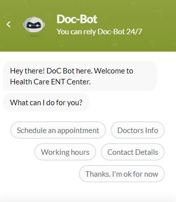
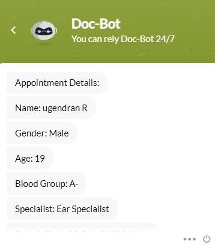
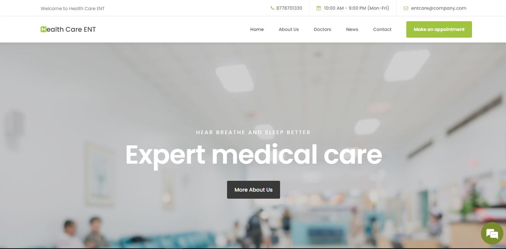
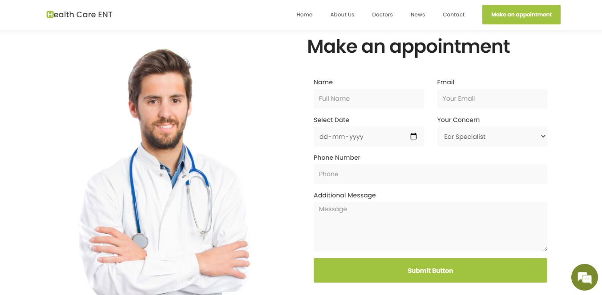

# Docbot
> Appointment confirmation Bot(Doc-bot) - https://ent-care.vercel.app/

## Table of contents
* Doc-Bot
* ENT Care Website
* Manual Appointment Registration.

## About
> The Purpose of this DoC-Bot is to help the user in setting up an appointment with the concerned ENT Doctor. 
Various SalesIQ Scripts' input cards has been used such as 
--->Email 
--->Phone 
--->Single Select Option 
--->Multiple Select Option 
--->Range Slider 
--->Calendar 
--->Location 
--->Date - Time Slots 
--->Star Rating 

Apart from input cards, other additional feature is been added:
  Once the user completes the appointment process, the user will receive the confirmation mail to his/her Mail_ID.

To summarize, 
 The user will have options to check Working hours, Doctors Info, Contact Details and Can book appointment as well.
During the Appointment process, the DoC-Bot collects information from the user namely
User Name, User mail Id,Phone No, Age, Blood Group, User's Concern, Location, Appointment Date and Time etc. Collecting these details, the Doc-bot 
will make an appointment and send the appointment details to the user through E-mail.
Finally star rating will be asked for the service provided by the bot.
 
# Appointment booking :p
https://user-images.githubusercontent.com/72851987/152409077-8fd0345f-a362-4a24-b2dc-66ece4f7f727.mp4
## Screenshots

    &emsp;    
  

  

## Technologies
* Deluge
* Salesiq
* HTML
* CSS
* Javascript

## Status
> Project - Completed
